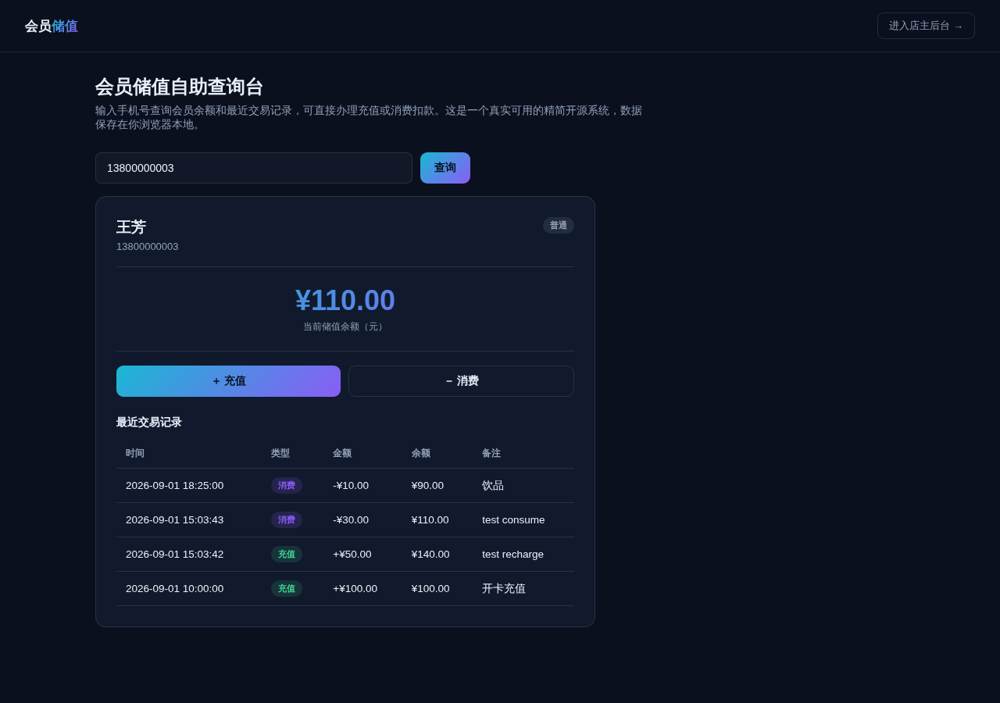

# 会员储值管理系统（精简开源版）· MemberCard Lite

**[在线体验（前台查询台）→](https://anna123123123-creator.github.io/membercard-lite/)** · **[店主后台 →](https://anna123123123-creator.github.io/membercard-lite/admin.html)**

免费开源的会员储值管理系统精简版。这不是截图或原型图，是一个**真实可用**的前后台系统：手机号查询会员余额、在线充值、消费扣款并校验余额是否充足，后台会员增删改查、交易流水筛选、数据看板——都是真功能，纯前端 + `localStorage` 实现，不需要服务器、不需要数据库，克隆下来打开就能用，也适合作为学习或二次开发的起点。



## 功能

**前台（收银/自助查询台）**
- 输入手机号查询会员姓名、等级、当前储值余额
- 查看最近交易记录（充值/消费、金额、交易后余额、备注、时间）
- 在线充值：输入金额即可为会员增加储值余额
- 在线消费：输入金额扣减余额，**自动校验消费金额不能超过当前余额**，超出会显示明确的错误提示

**后台（店主视角）**
- 仪表盘：会员总数、储值总余额（实时汇总所有会员余额）、本月充值总额、本月消费总额（按交易时间所属自然月实时计算），以及最新交易记录表
- 会员管理：新增、编辑、删除会员（姓名、手机号、余额、等级）
- 交易记录：全部充值/消费流水，按类型筛选，按时间倒序排列

## 试用方法

克隆下来，直接用浏览器打开 `index.html`，或用静态文件服务器跑起来：

```bash
python3 -m http.server 8000
```

前台在 `index.html`，后台在 `admin.html`。所有数据存在浏览器的 `localStorage` 里（`membercard_lite_data_v1` 这个 key），后台侧边栏有"重置示例数据"按钮可以随时清空重来。

## 技术说明

没有用任何框架或构建工具，纯原生 HTML/CSS/JavaScript，一共 5 个文件：`data.js`（数据层，负责 localStorage 读写和种子数据）、`index.html` + `script.js`（前台）、`admin.html` + `admin.js`（后台）。因为是纯前端 Demo，数据只存在当前浏览器里，不同设备/浏览器之间不会同步——真实生产系统需要一个后端 API 和数据库来替换 `data.js` 里的存储层，其余的界面和交互逻辑基本可以直接复用。

## 协议

MIT，随便怎么用都行。

## 相关项目

这是完整版**会员储值管理系统**的精简开源示例——完整版支持多门店余额互通、储值赠送梯度规则（充值满额自动赠送）、会员小程序/公众号自助充值、第三方支付网关对接与自动对账，源码在这：[全能源码 · 会员储值源码](https://inzyxuashop.com/huiyuanchuzhi-yuanma.html)。
